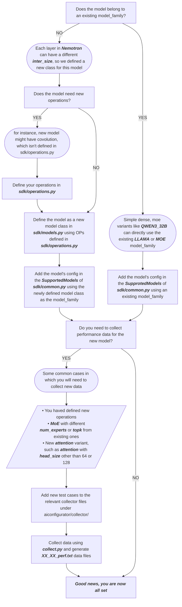

# How to Add a New Model

## Understanding How AIConfigurator Does End-to-End Latency Estimation

How to add a new model depends on how 'new' the model is. First, let's review how aiconfigurator does latency estimation.

In aiconfigurator, the end-to-end latency estimation depends on operation-level latency estimation. There are 3 steps to achieve this:

### 1. Break Down the Model into Operations

The model is broken down into operations, as shown in the source file [`models.py`](../src/aiconfigurator/sdk/models.py). A model is composed of operations such as GEMM and MoE defined in [`operations.py`](../src/aiconfigurator/sdk/operations.py).

### 2. Get Operation Latency Estimation

This relies on the **query** method:
```python
class Operation(object):
    """
    Base operation class.
    """
    def __init__(self, name: str, scale_factor: float) -> None:
        self._name = name
        self._scale_factor = scale_factor
    def query(self, database:PerfDatabase, **kwargs):
        raise NotImplementedError
    def get_weights(self, **kwargs):
        raise NotImplementedError
```
The query method will then call the [`PerfDatabase`](../src/aiconfigurator/sdk/perf_database.py) corresponding method. Taking the MoE operation as an example:

```python
def query(self, database: PerfDatabase, **kwargs):
    # attention dp size will scale up the total input tokens. 
    x = kwargs.get('x') * self._attention_dp_size
    overwrite_quant_mode = kwargs.get('quant_mode', None)
    quant_mode = self._quant_mode if overwrite_quant_mode is None else overwrite_quant_mode
    return database.query_moe(num_tokens=x, 
                            hidden_size=self._hidden_size, 
                            inter_size=self._inter_size, 
                            topk=self._topk, 
                            num_experts=self._num_experts,
                            moe_tp_size=self._moe_tp_size,
                            moe_ep_size=self._moe_ep_size, 
                            quant_mode=quant_mode, 
                            workload_distribution=self._workload_distribution) * self._scale_factor
```

The database contains the function **query_moe** which defines how we estimate the operation latency based on interpolation by querying the data we collected ahead of time.

### 3. Collect Data for the Operation

Taking MoE for TensorRT-LLM as an example, it's defined in [`collector/trtllm/collect_moe.py`](../collector/trtllm/collect_moe.py).

#### 3.1 Adding New Test Cases

If the MoE operation you want is not covered by the current inherited [database](../src/aiconfigurator/systems/data/h200_sxm/trtllm/1.0.0rc3/moe_perf.txt), you need to add the test case in `collect_moe.py` and collect your own data. 

For example, if you want to cover a new model with `num_experts=1024, topk=16`, you need to extend the **model_config_list** defined in the **`get_moe_test_cases()`** function in `collect_moe.py`.

#### 3.2 Update Database

Use the newly generated data by collect_moe.py `moe_perf.txt` to replace the inherited database's `moe_perf.txt` file and rebuild & reinstall aiconfigurator.


## Adding a New Model

Now let's revisit how to add a new model in aiconfigurator. There are 3 situations:

### Situation 1: Simple Variant to Supported Model Without New Operations

Check the supported model list in [`common.py`](../src/aiconfigurator/sdk/common.py), defined in **SupportedModels**.

If the model is a simple variant of one of the supported models (for example, it's similar to Qwen3 32B and only has slight differences, such as different positional embedding, different q/k/v heads of GQA, different number of layers, different hidden size), these are treated as **simple variants**. 

In this case, the only thing you need to do is add one line in **SupportedModels**:

```python
'NEW_MODEL': ['LLAMA', 128, 64, 4, 128, 64*128, 8192, 152064, 32768, 0, 0, 0, None]
```

This defines a new model similar to 'LLAMA' with:
- 128 layers
- 64 q heads and 4 kv heads of GQA
- Hidden dimension = 64*128
- Intermediate size = 8192
- Vocabulary size = 152064
- Context size = 32768  

Here 'LLAMA' is of the model families defined as **ModelFamily** in [`common.py`](../src/aiconfigurator/sdk/common.py)


### Situation 2: Variant to Supported Model but Requires Additional Data

This typically refers to a MoE model, as the MoE operation of a new model usually has different `num_experts` and `topk` values, etc. This difference is captured by different data points in aiconfigurator.

As mentioned above, you need to follow several steps to support this model:

1. Define a new MoE operation test case in `collect_moe.py` and follow the collector [README](../collector/README.md) to collect the MoE data points for your model.

2. Update the inherited database such as `src/aiconfigurator/systems/data/h200_sxm/trtllm/1.0.0rc3/moe_perf.txt` with the `moe_perf.txt` file you get in step 1.

3. Define the model similar to **Situation 1**, such as QWEN3_235B, it's a new model of model family **'MOE'**:
   ```python
   'QWEN3_235B': ['MOE', 94, 64, 4, 128, 4096, 12288, 151936, 40960, 8, 128, 1536, None]
   ```
   
   Please follow the comment lines in `common.py` to ensure the correct key values.

Models with different MLA operations also follow a similar process. For example, if it's a variant to model familiy 'DEEPSEEK' and has different definition of MLA, you need to collect new MLA data points.

### Situation 3: Model Needs New Operation Support

Today, we don't support the Mamba model yet. By looking at the Mamba model, it relies on the support of convolution operations. Convolution is not yet supported, so you need to add a new operation `Conv`.

Steps required:

1. **Define a new Operation `Conv`** in `operations.py`
2. **Define a new method `query_conv`** in `perf_database.py`
3. **Define the data collection process** in collector by referring to existing operations' collection code, such as `collect_gemm.py`
4. **Collect data for conv** and add the data file to systems in `src/aiconfigurator/systems/`
5. **Add data loading code** in `perf_database.py` to load your data, which is leveraged by the method `query_conv`
6. **Add new model definition** in `models.py` to build your model with new operation. A new model class is mapping to a new model family.  
update your model in ModelFamily dict defined in [`common.py`](../src/aiconfigurator/sdk/common.py)

## Final Steps

Rebuild & reinstall aiconfigurator to add this model's support.

---

> **Need Help?** If you still have difficulty adding the model you want, please create an issue in github.

## A Workflow For Reference
