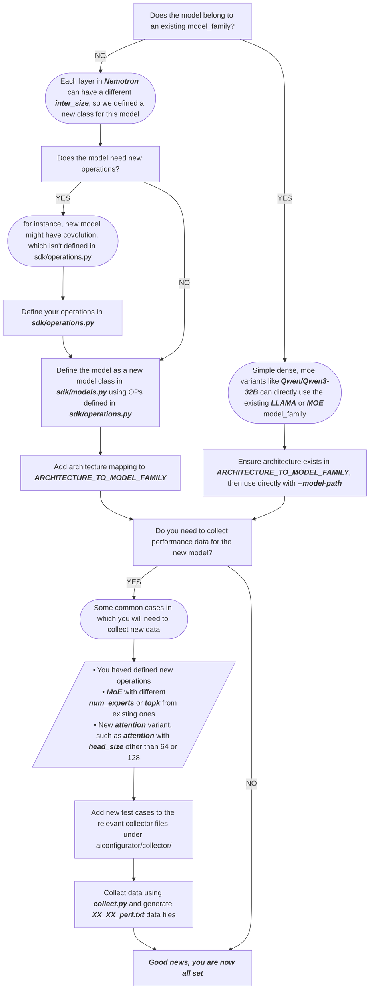

# How to Add a New Model

## Understanding How AIConfigurator Does End-to-End Latency Estimation

How to add a new model depends on how 'new' the model is. First, let's review how aiconfigurator does latency estimation.

In aiconfigurator, the end-to-end latency estimation depends on operation-level latency estimation. There are 3 steps to achieve this:

### 1. Break Down the Model into Operations

The model is broken down into operations, as shown in the source file [`models.py`](../src/aiconfigurator/sdk/models.py). A model is composed of operations such as GEMM and MoE defined in [`operations.py`](../src/aiconfigurator/sdk/operations.py).

### 2. Get Operation Latency Estimation

This relies on the **query** method:
```python
class Operation(object):
    """
    Base operation class.
    """
    def __init__(self, name: str, scale_factor: float) -> None:
        self._name = name
        self._scale_factor = scale_factor
    def query(self, database:PerfDatabase, **kwargs):
        raise NotImplementedError
    def get_weights(self, **kwargs):
        raise NotImplementedError
```
The query method will then call the [`PerfDatabase`](../src/aiconfigurator/sdk/perf_database.py) corresponding method. Taking the MoE operation as an example:

```python
def query(self, database: PerfDatabase, **kwargs):
    # attention dp size will scale up the total input tokens. 
    x = kwargs.get('x') * self._attention_dp_size
    overwrite_quant_mode = kwargs.get('quant_mode', None)
    quant_mode = self._quant_mode if overwrite_quant_mode is None else overwrite_quant_mode
    return database.query_moe(num_tokens=x, 
                            hidden_size=self._hidden_size, 
                            inter_size=self._inter_size, 
                            topk=self._topk, 
                            num_experts=self._num_experts,
                            moe_tp_size=self._moe_tp_size,
                            moe_ep_size=self._moe_ep_size, 
                            quant_mode=quant_mode, 
                            workload_distribution=self._workload_distribution) * self._scale_factor
```

The database contains the function **query_moe** which defines how we estimate the operation latency based on interpolation by querying the data we collected ahead of time.

### 3. Collect Data for the Operation

Taking MoE for TensorRT-LLM as an example, it's defined in `collector/trtllm/collect_moe_v*.py` (version-specific files, e.g. `collect_moe_v3.py` for trtllm >= 1.1.0).

#### 3.1 Adding New Test Cases

If the MoE operation you want is not covered by the current inherited [database](../src/aiconfigurator/systems/data/h200_sxm/trtllm/1.0.0rc3/moe_perf.txt), you need to add the test case in the appropriate `collect_moe_v*.py` and collect your own data. 

For example, if you want to cover a new model with `num_experts=1024, topk=16`, you need to extend the **model_config_list** defined in the **`get_moe_test_cases()`** function in the version-matched `collect_moe_v*.py` file.

#### 3.2 Update Database

Use the newly generated `moe_perf.txt` to replace the inherited database's `moe_perf.txt` file and rebuild & reinstall aiconfigurator.


## Adding a New Model

Now let's revisit how to add a new model in aiconfigurator. There are 3 situations:

### Situation 1: Simple Variant Without New Operations

If the model is a simple variant of an existing architecture (for example, it's similar to Qwen3 32B and only has slight differences, such as different positional embedding, different q/k/v heads of GQA, different number of layers, different hidden size), these are treated as **simple variants**.

In this case, you just need to ensure the architecture is supported in **ARCHITECTURE_TO_MODEL_FAMILY** in [`common.py`](../src/aiconfigurator/sdk/common.py):

```python
"YourModelForCausalLM": "LLAMA",  # or "MOE", "DEEPSEEK", etc.
```

AIConfigurator will automatically download the model's `config.json` from HuggingFace when you run with `--model-path your-org/Your-New-Model`. The model config is parsed to extract layer count, hidden size, attention heads, etc.

**Note**: If the architecture already exists in `ARCHITECTURE_TO_MODEL_FAMILY` (e.g., `LlamaForCausalLM`, `Qwen3ForCausalLM`, `MixtralForCausalLM`), no changes are needed - just use the model directly.

Here 'LLAMA', 'MOE', 'DEEPSEEK' are the model families defined in **ModelFamily** in [`common.py`](../src/aiconfigurator/sdk/common.py)


### Situation 2: Model Requires Additional Performance Data

This typically refers to a MoE model, as the MoE operation of a new model usually has different `num_experts` and `topk` values, etc. This difference is captured by different data points in aiconfigurator.

You need to follow several steps:

1. Define a new MoE operation test case in the version-matched `collect_moe_v*.py` and follow the collector [README](../collector/README.md) to collect the MoE data points for your model.

2. Update the inherited database such as `src/aiconfigurator/systems/data/h200_sxm/trtllm/1.0.0rc3/moe_perf.txt` with the `moe_perf.txt` file you get in step 1.

3. Ensure the architecture mapping exists in **ARCHITECTURE_TO_MODEL_FAMILY** (see **Situation 1**).

Models with different MLA operations also follow a similar process. For example, if it's a variant to model family 'DEEPSEEK' and has different definition of MLA, you need to collect new MLA data points.

### Situation 3: Model Needs New Operation Support

Today, we don't support the Mamba model yet. By looking at the Mamba model, it relies on the support of convolution operations. Convolution is not yet supported, so you need to add a new operation `Conv`.

Steps required:

1. **Define a new Operation `Conv`** in `operations.py`
2. **Define a new method `query_conv`** in `perf_database.py`
3. **Define the data collection process** in collector by referring to existing operations' collection code, such as `collect_gemm.py`
4. **Collect data for conv** and add the data file to systems in `src/aiconfigurator/systems/`
5. **Add data loading code** in `perf_database.py` to load your data, which is leveraged by the method `query_conv`
6. **Add new model definition** in `models.py` to build your model with new operation. A new model class is mapping to a new model family.  
update your model in ModelFamily dict defined in [`common.py`](../src/aiconfigurator/sdk/common.py)

## Final Steps

Rebuild & reinstall aiconfigurator to add this model's support.

---

> **Need Help?** If you still have difficulty adding the model you want, please create an issue in github.

## A Workflow For Reference

```mermaid
flowchart TD
    A[Does the model belong to an existing model_family?]
    A --> |YES| B([Simple dense, moe variants like <i><b>Qwen/Qwen3-32B</b></i> can directly use the existing <i><b>LLAMA</b></i> or <i><b>MOE</b></i> model_family])
    B --> C[Ensure architecture exists in <i><b>ARCHITECTURE_TO_MODEL_FAMILY</b></i>, then use directly with <i><b>--model-path</b></i>]
    A --> |NO| D([Each layer in <i><b>Nemotron</b></i> can have a different <i><b>inter_size</b></i>, so we defined a new class for this model])
    D --> E[Does the model need new operations?]
    E --> |YES| F([for instance, new model might have covolution, which isn't defined in sdk/operations.py])
    F --> G[Define your operations in <b><i>sdk/operations.py</b></i>]
    G --> H[Define the model as a new model class in <i><b>sdk/models.py</b></i> using OPs defined in <i><b>sdk/operations.py</b></i>]
    E --> |NO|H
    H --> i[Add architecture mapping to <i><b>ARCHITECTURE_TO_MODEL_FAMILY</b></i>]
    i --> j[Do you need to collect performance data for the new model?]
    C --> j
    j --> |YES|K([Some common cases in which you will need to collect new data])
    K --> L[/• You haved defined new operations<br/> • <i><b>MoE</b></i> with different <i><b>num_experts</b></i> or <i><b>topk</b></i> from existing ones<br/>• New <i><b>attention</b></i> variant, such as <b><i>attention</b></i> with <b><i>head_size</b></i> other than 64 or 128/]
    L --> M[Add new test cases to the relevant collector files under aiconfigurator/collector/]
    M --> N[Collect data using <i><b>collect.py</b></i> and generate <i><b>XX_XX_perf.txt</b></i> data files]
    N --> Z
    j --> |NO|Z[<i><b>Good news, you are now all set</b></i>]
```