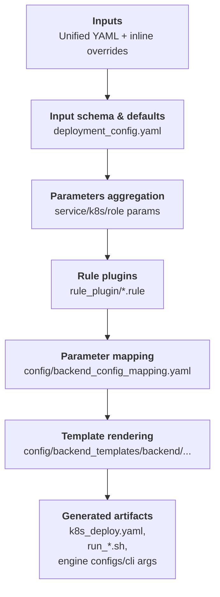

## Generator Overview

This doc explains what the generator emits, the roles of its core pieces, and how to run it to produce backend configs, bash scripts, and kubernetes yaml.

### End-to-End Flow


### Key Components
- Deployment schema (`config/deployment_config.yaml`):
  ```
  inputs:
    - key: ServiceConfig.port
    - key: ServiceConfig.served_model_name
    - key: K8sConfig.k8s_image
    - key: K8sConfig.k8s_model_cache
    - key: K8sConfig.k8s_hf_home
    - key: WorkerConfig.prefill_workers
    - key: SlaConfig.isl
  ```
  Defines the deployment-facing inputs beyond backend flags: service ports and names, per-node GPU counts, K8s image/namespace/engine mode, model cache PVC, HuggingFace home directory, and SLA knobs like ISL/OSL.

  **Model Cache Configuration:**
  - `k8s_model_cache`: Name of the PersistentVolumeClaim (PVC) to mount for caching HuggingFace models. The PVC is mounted at `/workspace/model_cache` in worker pods.
  - `k8s_hf_home`: (Optional) Path to set as the `HF_HOME` environment variable in worker pods. When `k8s_model_cache` is configured but `k8s_hf_home` is not explicitly set, it automatically defaults to `/workspace/model_cache` (the PVC mount point). This ensures HuggingFace libraries download models to the persistent volume instead of ephemeral storage.

- Backend parameter mapping (`config/backend_config_mapping.yaml`):  
  ```
  - param_key: tensor_parallel_size
    vllm: tensor-parallel-size
    sglang: tensor-parallel-size
    trtllm: tensor_parallel_size
  - param_key: cuda_graph_enable_padding
    sglang:
      key: disable-cuda-graph-padding
      value: "not cuda_graph_enable_padding"
    trtllm:
      key: cuda_graph_config.enable_padding
      value: "cuda_graph_enable_padding"
  ```
  Harmonizes three backends under unified field names and applies simple logic to handle small semantic differences between them.

- Rule plugins (`rule_plugin/*.rule`):  
  ```
  agg_prefill_decode gpus_per_worker = (tensor_parallel_size or 1) * (pipeline_parallel_size or 1) * (data_parallel_size or 1)
  prefill max_batch_size = (max_batch_size if max_batch_size else 1)
  ```
  DSL rules users can extend to influence generated configs. Field names come from `backend_config_mapping.yaml` and `deployment_config.yaml`; prefixes like `agg_`, `prefill_`, and `decode_` scope the impact to that role’s generated outputs.
  
  **Rule selection**: Use `--generator-set rule=benchmark` to switch to a different rule plugin folder under `src/aiconfigurator/generator/rule_plugin/`. If `rule` is not provided, the default production rules are used (tuned for deployment, including max batch size and CUDA graph batch size adjustments). The `benchmark` rules are designed to align generated configs with AIC simulation, using broader CUDA graph batch sizes and a stricter max batch size derived from the simulated batch size. You can add your own rule sets by creating a folder under `rule_plugin/` and selecting it via `--generator-set rule=<folder_name>`.

- Backend templates (`config/backend_templates/<backend>/`):  
  Jinja templates that turn mapped parameters into CLI args, engine configs, run scripts, and Kubernetes manifests (optionally versioned). 

### Using the Generator
You can use the generator in three ways: AIConfigurator CLI, webapp, or standalone (code/CLI).
- AIConfigurator CLI end-to-end:
  ```
  aiconfigurator cli default \
    --backend sglang \
    --backend-version 0.5.6.post2 \
    --model-path Qwen/Qwen3-32B-FP8 \
    --system h200_sxm \
    --total-gpus 8 \
    --isl 5000 --osl 1000 --ttft 2000 --tpot 50 \
    --generator-set ServiceConfig.model_path=Qwen/Qwen3-32B-FP8 \
    --generator-set ServiceConfig.served_model_name=Qwen/Qwen3-32B-FP8 \
    --generator-set K8sConfig.k8s_engine_mode=inline \
    --generator-set K8sConfig.k8s_namespace=ets-dynamo \
    --save-dir ./results
  ```
  Notes:
  - Use `--generator-dynamo-version 0.7.1` to select the Dynamo release. This affects both the generated backend config version and the default K8s image tag.
  - If `--generator-dynamo-version` is not provided, the default is the first entry in `backend_version_matrix.yaml` (currently `1.0.0`).
  - If `--generated-config-version` is provided, it overrides the generated backend version, but the default K8s image tag still follows the selected Dynamo version mapping.
- Webapp: start with `--enable_profiling` when launching the webapp to surface generator-driven configs.
- Standalone:
  - In code:
    ```python
    from pathlib import Path
    from aiconfigurator.generator.api import (
        generate_backend_artifacts,
        generate_backend_config,
        generate_config_from_input_dict,
    )

    input_params = {
        "SlaConfig": {"isl": 32768, "osl": 1024},
        "ServiceConfig": {
            "model_path": "nvcr.io/nvidia/nemo-llm/llama-2-7b-chat-hf:1.0.0",
            "served_model_name": "llama-2-7b-chat",
            "head_node_ip": "10.0.0.100",
            "port": 8000,
            "include_frontend": True,
        },
        "K8sConfig": {
            "name_prefix": "llama7b",
            "mode": "disagg",
            "enable_router": True,
            "k8s_namespace": "dynamo",
            "k8s_image": "nvcr.io/nvidia/ai-dynamo/tensorrtllm-runtime:0.8.0",
            "k8s_engine_mode": "configmap",
            "k8s_model_cache": "pvc:model-cache-7b",
            "k8s_hf_home": "/workspace/model_cache",  # Optional: HF_HOME env var for workers (defaults to /workspace/model_cache when k8s_model_cache is set)
        },
        "Workers": {
            "prefill": {"tensor_parallel_size": 4, "max_batch_size": 8},
            "decode": {"tensor_parallel_size": 2, "max_batch_size": 16, "max_seq_len": 4096},
        },
        "WorkerConfig": {"prefill_workers": 1, "decode_workers": 2},
    }

    params = generate_config_from_input_dict(input_params, backend="trtllm")
    artifacts = generate_backend_artifacts(params, backend="trtllm", output_dir="./results/sample", backend_version="1.2.0rc5")
    ```
  - Command line: `python -m aiconfigurator.generator.main render-artifacts --backend trtllm --version 1.2.0rc5 --config sample_input.yaml --output ./results`
    ```
    # Sample sample_input.yaml
    
    ServiceConfig:
      model_path: Qwen/Qwen3-32B-FP8
      served_model_name: qwen3-32b
      head_node_ip: 0.0.0.0
      port: 8000
    K8sConfig:
      k8s_namespace: dynamo
      k8s_image: nvcr.io/nvidia/ai-dynamo/tensorrtllm-runtime:0.8.0
    WorkerConfig:
      prefill_workers: 1
      decode_workers: 1
    Workers:
      prefill:
        tensor_parallel_size: 2
        pipeline_parallel_size: 1
        data_parallel_size: 1
      decode:
        tensor_parallel_size: 2
        pipeline_parallel_size: 1
        data_parallel_size: 1
    SlaConfig:
      isl: 4000
      osl: 1000
    ```

### Generated Outputs
- [vllm & sglang] CLI argument strings per role (prefill/decode/agg) for debugging or manual runs.
- [trtllm] Engine config files (`agg_config.yaml`, `prefill_config.yaml`, `decode_config.yaml`) when the backend provides `extra_engine_args*.j2`.
- Run scripts (`run_0.sh`, `run_1.sh`, …) that assign workers to nodes and toggle frontend on the first node.
  - Note: If `model_path` is empty and you expect to automatically download the HuggingFace model, multiple processes may fetch the same model concurrently and hit the HF cache lock. In that case, download the model once at the target path before running.
- Kubernetes manifest (`k8s_deploy.yaml`) with images, namespace, volumes, engine args (inline or ConfigMap), and role-specific settings.
- Benchmark helpers:
  - `bench_run.sh` and `k8s_bench.yaml` are generated alongside deployment artifacts for running `aiperf` benchmarks.
  - `concurrency_array` is built from a base list (`1 2 8 16 32 64 128`) plus `BenchConfig.estimated_concurrency` and its +/-5% neighbors when the estimate is available.

### TRT-LLM Deployment Notes
When deploying with TRT-LLM, the generated run scripts (`run_x.sh`) reference engine config files at `/workspace/engine_configs/`. Before executing the run scripts, you must:

1. Create the engine configs directory:
   ```bash
   mkdir -p /workspace/engine_configs
   ```

2. Copy the generated engine config files to this location:
   ```bash
   # For aggregated mode:
   cp agg_config.yaml /workspace/engine_configs/
   
   # For disaggregated mode:
   cp prefill_config.yaml decode_config.yaml /workspace/engine_configs/
   ```

3. Execute the run script:
   ```bash
   bash run_0.sh
   ```

Refer to the [Dynamo Deployment Guide](dynamo_deployment_guide.md) for detailed deployment instructions. 

### Generator Validator
The generator validator checks that generated engine configs or CLI args are accepted by the backend runtime version. It parses the generated output using each backend's argument schema and reports unknown or invalid flags early.

**Usage (run inside the matching runtime image):**
- TRT-LLM runtime image (e.g. `tensorrtllm-runtime`):
  ```
  python tools/generator_validator/validator.py \
    --backend trtllm \
    --path /path/to/results
  ```
- vLLM runtime image:
  ```
  python tools/generator_validator/validator.py \
    --backend vllm \
    --path /path/to/results
  ```
- SGLang runtime image:
  ```
  python tools/generator_validator/validator.py \
    --backend sglang \
    --path /path/to/results
  ```

**`--path` meaning (file or directory):**
- File: point directly to a single engine config YAML (TRT-LLM) or `k8s_deploy.yaml` (vLLM/SGLang).
- Directory: point to a generator results root with the expected layout:
  - TRT-LLM: `agg/top1/agg_config.yaml` and `disagg/top1/{decode,prefill}_config.yaml`
  - vLLM / SGLang: `agg/top1/k8s_deploy.yaml` and `disagg/top1/k8s_deploy.yaml`

**How it works (high level):**
- TRT-LLM: loads `tensorrt_llm.llmapi.llm_args.TorchLlmArgs` and validates keys against the runtime schema.
- vLLM: loads `vllm.engine.arg_utils.EngineArgs` and parses CLI args to build an engine config.
- SGLang: loads `sglang.srt.server_args.ServerArgs` and parses CLI args found in the generated Kubernetes manifest.